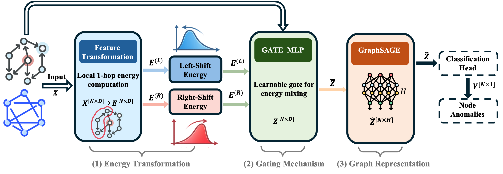

# Modeling Spectral Energy Shifts in Spatio-Temporal Graph Anomaly Detection

**Accepted to ICML 2026 (the 43rd International Conference on Machine Learning)**

This repository contains the official implementation of the paper:

> **Modeling Spectral Energy Shifts in Spatio-Temporal Graph Anomaly Detection**
>
> Yilin Liu, Hongchao Zhang, Taylor T. Johnson, Ahmad F. Taha, Meiyi Ma
>
> *Proceedings of the 43rd International Conference on Machine Learning (ICML), Seoul, South Korea. PMLR 306, 2026.*

## Overview

We propose the **Energy Graph Neural Network (EGNN)**, a node-level spectral-energy-based framework for graph anomaly detection. EGNN addresses two key limitations of existing spectral methods:

1. **Limited scope**: Prior spectral formulations focus on high-variance "right-shift" anomalies and overlook *camouflaged anomalies* that mimic benign behavior, producing a previously uncharacterized "left-shift" phenomenon.
2. **Scalability**: Graph-level spectral energy computation is costly. EGNN uses local energy surrogates compatible with message passing to approximate graph energy efficiently.

EGNN further extends to temporal graph settings without introducing specialized sequence modules, enabling efficient learning under long sliding windows with orders of magnitude fewer parameters than existing temporal methods.

<p align="center">
  
</p>

## Key Contributions

- **Camouflaged anomaly characterization**: We reveal and formalize a left-shift spectral energy pattern across multiple public datasets (YelpChi, Amazon), where anomalous nodes exhibit *lower* spectral energy than normal nodes.
- **Node-level spectral energy formulation**: A localized Rayleigh quotient formulation (Eq. 3) that is fully compatible with GNN message passing.
- **Adaptive gating mechanism**: A learnable MLP gate that dynamically combines right-shift and left-shift energy representations per feature.
- **Unified static and temporal architecture**: The same EGNN architecture handles both static and time-series graphs, with temporal dependencies captured via energy transformations and adaptive gating within sliding windows.

## Repository Structure

```
.
├── E_train.py            # Training script for static graph datasets (Amazon, YelpChi, T-Finance, T-Social)
├── f_train2.py           # Training script for time-series datasets (MSL, SWaT, WADI)
├── f_model2.py           # Temporal EGNN model (TemporalGatedEnergySAGE)
├── fast_e.py             # Efficient local 1-hop spectral energy computation
├── dataloader_semi.py    # Data loader for time-series datasets with sliding window
├── get_amazon.py         # Amazon dataset loader
├── get_yelp.py           # YelpChi dataset loader
├── get_tfinance.py       # T-Finance dataset loader
├── get_tsocial.py        # T-Social dataset loader
├── LICENSE               # MIT License
└── README.md
```

## Installation

### Requirements

- Python >= 3.8
- PyTorch >= 1.12
- DGL >= 1.0
- NumPy
- scikit-learn
- pandas

```bash
pip install torch dgl numpy scikit-learn pandas
```

For GPU support, install the appropriate PyTorch and DGL versions for your CUDA version. See [PyTorch](https://pytorch.org/get-started/locally/) and [DGL](https://www.dgl.ai/pages/start.html) installation guides.

## Datasets

### Static Graph Datasets

| Dataset | Nodes | Edges | Anomaly Ratio | Features |
|---------|------:|------:|--------------:|---------:|
| Amazon | 11,944 | 4,398,392 | 6.87% | 25 |
| YelpChi | 45,954 | 3,846,979 | 14.53% | 32 |
| T-Finance | 39,357 | 21,222,543 | 4.58% | 10 |
| T-Social | 5,781,065 | 73,105,508 | 3.01% | 10 |

Amazon and YelpChi are downloaded automatically via DGL. T-Finance and T-Social require manual download from [GADBench](https://github.com/squareRoot3/GADBench).


Time-series datasets should be placed under `./data/{dataset_name}/` with `train.csv`, `test.csv`, and `list.txt`. See [dataloader_semi.py](dataloader_semi.py) for expected formats and preprocessing instructions.

## Usage

### Static Graph Anomaly Detection

```bash
# Single run on Amazon
python E_train.py --dataset amazon --epochs 300 --runs 1

# Single run on YelpChi
python E_train.py --dataset yelp --epochs 300 --runs 1

# Single run on T-Finance
python E_train.py --dataset tfinance --epochs 300 --runs 1

# Single run on T-Social
python E_train.py --dataset tsocial --epochs 300 --runs 1

# Multiple runs (10 runs with different seeds, reports mean +/- std)
python E_train.py --dataset amazon --runs 10
```

**Key arguments:**

| Argument | Default | Description |
|----------|---------|-------------|
| `--dataset` | `yelp` | Dataset: `amazon`, `yelp`, `tfinance`, `tsocial` |
| `--hidden_dim` | `128` | Hidden dimension of GraphSAGE layers |
| `--dropout` | `0.5` | Dropout rate |
| `--gate_type` | `per_feature` | Gate type: `per_feature` or `per_node` |
| `--gate_hidden_dim` | `16` | Hidden dimension of the gating MLP |
| `--gate_num_layers` | `2` | Number of layers in the gating MLP |
| `--epochs` | `300` | Maximum training epochs |
| `--lr` | `0.01` | Learning rate |
| `--train_ratio` | `0.4` | Training set ratio |
| `--runs` | `10` | Number of experiment runs |

### Time-Series Graph Anomaly Detection

```bash
# Preprocess data (run once)
python dataloader_semi.py --preprocess swat wadi

# Train on MSL
python f_train2.py --dataset msl --epochs 100 --runs 1

# Train on SWaT
python f_train2.py --dataset swat --epochs 100 --runs 1

# Train on WADI
python f_train2.py --dataset wadi --epochs 100 --runs 1

# Multiple runs
python f_train2.py --dataset msl --runs 10
```

**Key arguments:**

| Argument | Default | Description |
|----------|---------|-------------|
| `--dataset` | `msl` | Dataset: `msl`, `swat`, `wadi` |
| `--slide_win` | `15` | Sliding window size |
| `--slide_stride` | `1` | Sliding window stride |
| `--batch_size` | `64` | Training batch size |
| `--hidden_dim` | `128` | Hidden dimension |
| `--epochs` | `100` | Maximum training epochs |
| `--lr` | `0.005` | Learning rate |
| `--runs` | `1` | Number of experiment runs |

## Results

### Graph Anormaly Detection Result

| Model | Amazon F1-m | YelpChi F1-m | T-Finance F1-m | T-Social F1-m |
|-------|------:|------:|------:|------:|
| GCN | 63.22 | 55.70 | 72.63 | 65.34 |
| BWGNN | 91.40 | 71.78 | 84.67 | 81.78 |
| UniGAD | 90.46 | 71.23 | 89.34 | 78.67 |
| **EGNN (Ours)** | **91.52** | **76.89** | **89.60** | **95.40** |


## Citation

```bibtex
@inproceedings{
}
```

## Acknowledgments

This work was supported in part by the National Science Foundation under grants NSF 2443803 and 2230087.

## License

This project is licensed under the MIT License. See [LICENSE](LICENSE) for details.
